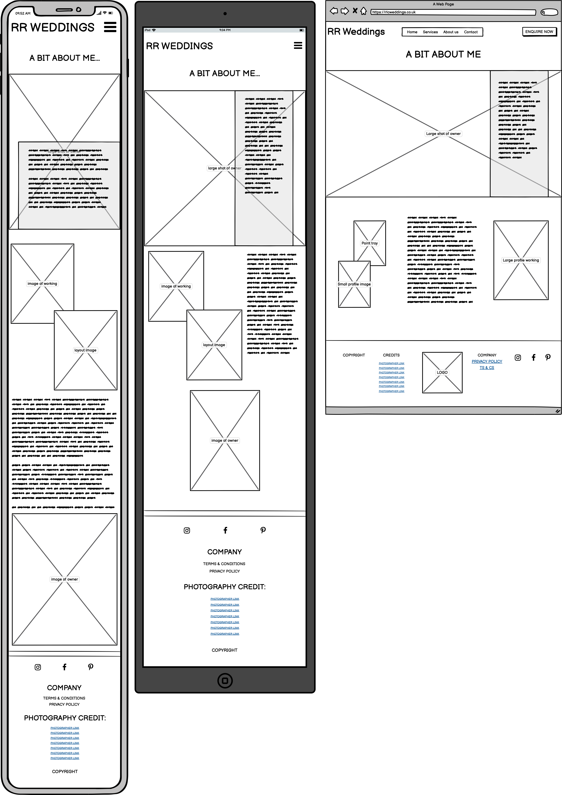
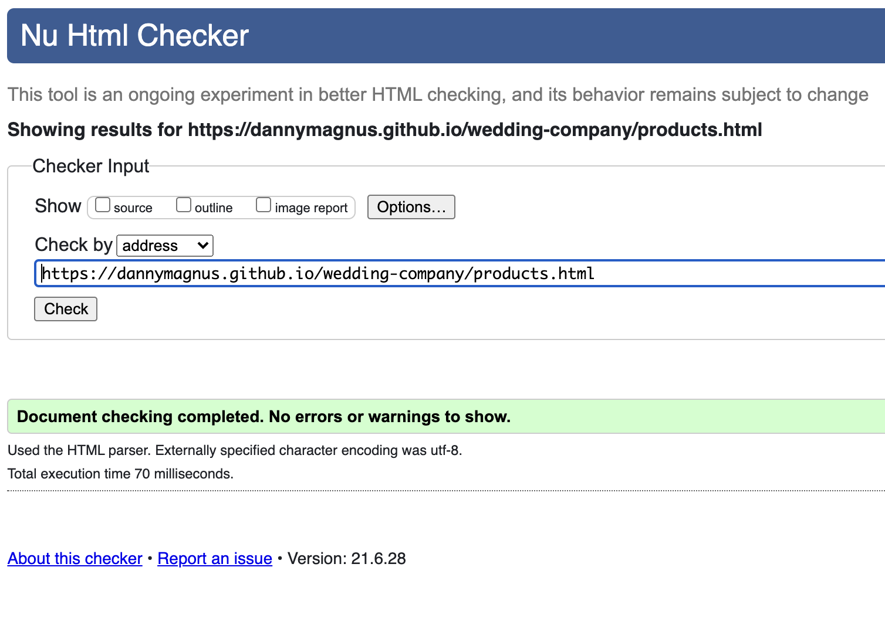
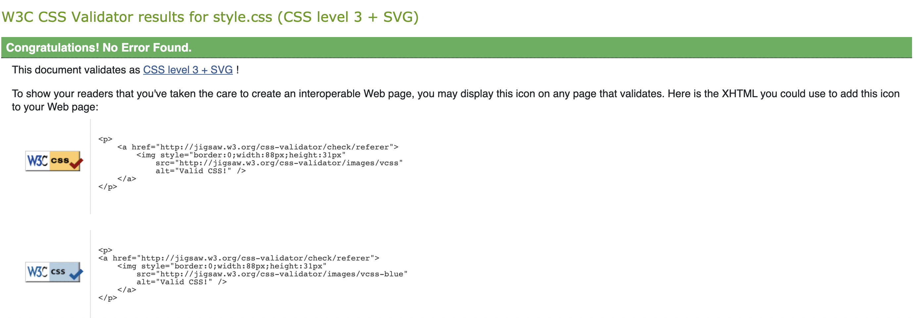
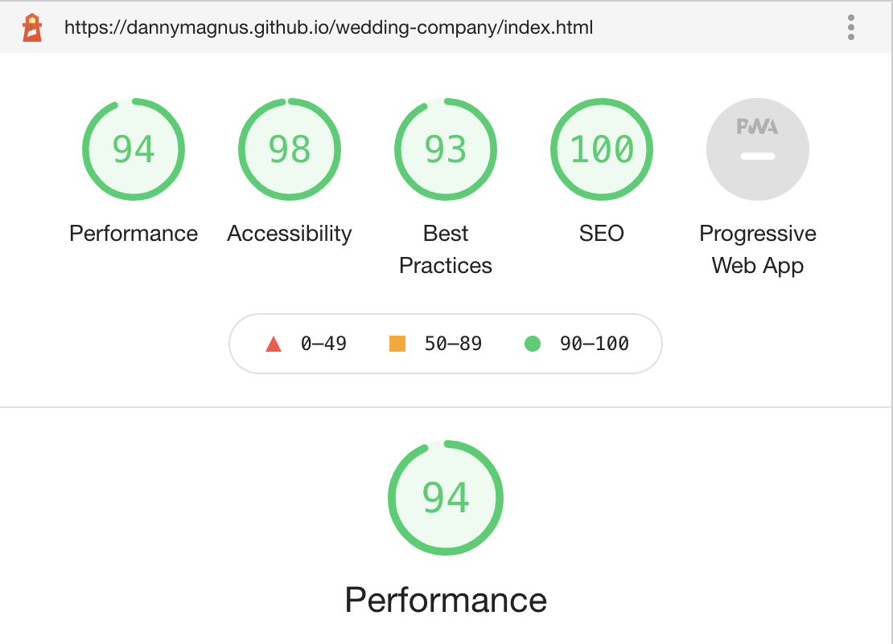

# RR Weddings
(Developer: Daniel Richards)

[View live site](https://dannymagnus.github.io/wedding-company/)

## Table of Content

1. [Project Goals](#project-goals)
    1. [User Goals](#user-goals)
    2. [Site Owner Goals](#site-owner-goals)
2. [User Experience](#user-experience)
    1. [Target Audience](#target-audience)
    2. [User Requirements and Expectations](#user-requirements-and-expectations)
    3. [User Stories](#user-stories)
3. [Scope](#scope)
4. [Design](#design)
    1. [Design Choices](#design-choices)
    2. [Colour](#colours)
    3. [Fonts](#fonts)
    4. [Structure](#structure)
    5. [Wireframes](#wireframes)
5. [Technologies Used](#technologies-used)
    1. [Languages](#languages)
    2. [Frameworks & Tools](#frameworks-&-tools)
6. [Features](#features)
7. [Testing](#validation)
    1. [HTML Validation](#HTML-validation)
    2. [CSS Validation](#CSS-validation)
    3. [Accessibility](#accessibility)
    4. [Performance](#performance)
    5. [Device testing](#performing-tests-on-various-devices)
    6. [Browser compatibility](#browser-compatibility)
    7. [Testing user stories](#testing-user-stories)
8. [Bugs](#Bugs)
10. [Deployment](#deployment)
11. [Credits](#credits)
12. [Acknowledgements](#acknowledgements)

## Project Goals 

### User Goals
- Finding stationary products and services for wedding events.
- See example products and be able to contact the company.
- Find information about the restaurant.
- Get ideas and inspiration for wedding stationary.

### Site Owner Goals
- To generate leads for sales of the different wedding stationery packages. 
- To create a brand identity which stands out in a crowded market by showing the unique creation methods.
- To reach a wider audience base outside of local wedding fayres and wedding venue network

## User Experience

### Target Audience
- Brides
- Grooms
- wedding planners
- wedding venues

### User Requirements and Expectations

- An easy navigation system with instant learning.
- Able to navigate the site quickly and easily.
- No broken links.
- Responsive and visually appealing on all devices.
- An easy way to contact the bussiness
- Easy access to content through links but not too deep into site
- Accessibility

### User Stories

#### First-time User 
1. As a first time user; I want to be able to navigate the site and access the information easily.
2. As a first time user; I want to be able to get ideas and inspiration for my wedding stationery.
3. As a first time user; I want to see that the businesses values match my own.
4. As a first time user; I want to find some wedding stationery that will set the tone of my wedding and give that ‘wow’ factor.
5. As a first time user; I want to be able to see some indication of prices and timescales so I know whether this product is right for me.
6. As a first time user; I want to be able to contact the business if I have any initial queries easily. 
7. As a first time user; I want to work with a brand that is trustworthy and credible as the wedding will be one of the most important days of my life.

#### Returning User
8. As a return visitor; I want an easy way to get in touch with the business to proceed with my purchase.

#### Site Owner 
9. As a site owner; I want potential clients to be able to be able to view imagery to inspire and attract them to book or purchase.
10. As a site owner; I want prospective customers to be able to get in touch with me easily with any queries.
11. As a site owner; I want prospective customers to be able to contact me via email alternatively to book their wedding stationery or for follow up queries.
12. As a site owner; I want customers to be able to find information about my products easily to help them find the best design package to suit their needs.

## Scope

The scope of the project in it’s first release is defined by the following features: 

- Responsive navigation bar mirrored across each page which enables users to navigate the site without user the browser buttons.
- A footer across all pages with links to social media, terms and conditions with pricing, links to featured partners. 
- Modal where you can book an intial enquiry with the site owner/company.
- Pricing page which communicates the costs of the different products and packages simply. 
- Contact form where the customer can send an enquiry, when all fields are populated.
- Embedded map with pin to show company location.
- Contact details with email address and business address for further correspondance and to provide more that one contact method. 
- An as featured in section to incorporate badges to give business credibility. 
- An about page to with information about the business and owner to build a personal connection and trust.
- A products page with introduction to products on offer with entry price points.
- Embedded video to show the creation process and increase interaction with the site.
- An example image gallery for two off the shelf designs.
- Favicon icon to help users identify the site.

Features to be built in future releases: 

- Further four designs with image galleries in customisable section. 
- Links to downloadable price lists for each suite of options.
- A page for 'on the day' stationary offerings, to include propositions such as menus, place cards, orders of service, signage.

## Design

### Design Choices
My theme for the design came from the brand imagery. I wanted to create a website that would compliment but not overshadow the galleries to ensure they stand out to customers. 
I wanted it to appear soft with romantic elements to match the target audience, which mostly consists of female brides, and I used inspiration from nature to compliment the products on offer.

I wanted a site that was straightforward, with the information being concise and clear in a way that’s easy to navigate.

### Colour
- Text headings - #383d41
- Text Body - #383d41
- Background colours - #fff
- Modals and buttons - rgba(250, 218, 221, 0.5)

These colours have been chosen as they fit with the images that will be used for background and for foreground images and a representative of the end product.  They must also be suitable for accessibility support.
 

### Fonts
My heading font is Cormorant Garamond from Google Fonts. I chose this font because:
- The elegant and curved nature is similar to the fonts used in the products on display. 
- It gives a contrast to the font used for the body text so the headers stand out.
 
My body font is Playfair Display from Google Fonts. I chose this font because:
It contrasts well with the header font.

### Structure
The structure of the site is to contain four pages in order; 
- Home 
- Products
- About
- Contact

Each page contains the following structure

*Brand logo text* - Clicking this will return the user to the landing page regardless from which page it is selected.

*Navbar* - A responsive navbar to be featured in the header of each page.  The links will be ordered from left to right in order of priority to the site and project goals and will link to each of the four pages listed above.  A modal enquiry button will also be featured unless on mobile devices for a quick enquiry form.

*Title Banner* - to display current page on view.

*Content Blocks* - The top most being the highest priority information flowing downwards to the lower tiers of priority. The structure will follow the law of thirds to make it visually appealing to users.  These blocks will contain call to action in each page, either inline or modal to contact the business and internal links following the sales progression where appropriate.

*Footer* - This will display image credits and link to other business partners eg wedding photography, it will have terms and conditions link as well as social media links.

### Wireframes

Home

Products

About Us

Contact

## Technologies Used

### Languages
- [HTML5](https://en.wikipedia.org/wiki/HTML5)
- [CSS3](https://en.wikipedia.org/wiki/CSS)

### Frameworks & Tools
1. [Git](https://git-scm.com/)
- Git was used for version control within VSCode to push the code to GitHub.
2. [GitHub](https://github.com/)
- GitHub was used as a remote repository to store project code. 
3. [GIMP](https://www.gimp.org/)
- GIMP was used to edit, crop, resize and convert files found within each of the site pages.
4. [Balsamiq](https://balsamiq.com/)
-  Balsamiq was my choice for creating wireframes for the site.
5. [Font Awesome](https://fontawesome.com/)
- Font awesome was used to generate the social media footer icons on each page.
6. [Google Fonts](https://fonts.google.com/)
- Cormorant Garamond and Playfair Display were the fonts taken from Google for headings and body respectively.
7. [Bootstrap v5.0](https://getbootstrap.com/docs/5.0/getting-started/introduction/)
- Bootstrap was used for the landing carousel, responsive nav bar, contact form modal, privacy policy and general terms and conditions modals.
8. [Am I Responsive](http://ami.responsivedesign.is/)
- The mockup image was created using Am I Responsive
9. [Gitpod](https://gitpod.io/)
- Gitpod was used in part to write the code for this project.
10. [Visual Studio Code (VSCode)](https://code.visualstudio.com/)
- VSCode was the IDE used to write the remainder of the project code.
11. [Google Maps](https://www.google.co.uk/maps)
- Google Maps was used for the iframe in contact information.

## Features

The website consists of four pages and 8 features.

### Current Features

### Feature 1: home page

The sections of home page include:

The main feature of the home page is the slideshow which plays on entry to the site.
A ‘why us’ section which aims to build trust with potential customers
A ‘featured’ to build brand credibility
A ‘testimonials’ section to build trust with potential customers.
Modal pop up form to enable customers to contact the business easily
The footer contains links to social media to provide additional inspiration for visitors.

The site is fully responsive and tested on tablet on mobile. The copy is partially written by myself in addition to copy given by RRweddings. Permission has been granted in all cases.

*Section 1 – Slideshow:*

The slideshow is the first impression that the business gets to make on the visitor. I chose 3 images all with a cohesive theme in terms of the colour palette and the styling. It plays automatically to add some movement to the page.

*Section 2 – Why Us:*

The why us section has text and images with a call to action. The imagery shows the business owner which aims to build trust with potential customers. The call to action provides an easy way for customers to get in touch quickly.

*Section 3 – Featured:*

The featured section shows the business logos of high profile wedding businesses which the brand has been featured in. This aims to show credibility and to show customers that the products on offer are of a high standard.

*Section 4 – Testimonials:*

The testominals section is comprised of text boxes with previous customers reviews. This is important to have visible on the first page to help build trust with prospective customers.

*Section 5 – Modal pop up form:*

The pop up form appears when a visitor chooses 'Enquire Now' or 'Get in Touch'. For more information see feature 7.

*Section 6 – footer:*

The footer is a feature across all pages but is important to allow customers to explore other areas of the business and gain more inspiration. For more information about the footer see feature 6.

**The home page features highlight the following user stories:**

*2. As a first time user; I want to be able to get ideas and inspiration for my wedding stationery.*

*3. As a first time user; I want to see that the businesses values match my own.*

*4. As a first time user; I want to find some wedding stationery that will set the tone of my wedding and give that ‘wow’ factor.*

*6. As a first time user; I want to be able to contact the business if I have any initial queries easily.*

*7. As a first time user; I want to work with a brand that is trustworthy and credible as the wedding will be one of the most important days of my life.*

*8. As a return visitor; I want an easy way to get in touch with the business to proceed with my purchase.*

*10. As a site owner; I want prospective customers to be able to get in touch with me easily with any queries.*

### Feature 2: Products

The sections of home page include:

The hero image with internal page links.
The ‘bespoke’ section provides product information
The ‘customisable’ section provides product information
The ‘Anemone’ section is a product example with pricing.
The ‘Peony section is a product example with pricing.
The call to action takes the customer straight to a contact form.

*Section 1 - Product hero image and internal page links

The product hero image is aimed to capture to visitors attention and to maintain the brand identity throughout the different pages. The internal page links provide easy navigation access.

*Section 2 - Bespoke

The bespoke section provides the customer with a product description, and copy including pricing and timescales, alongside a demonstration video.
The video adds another dimension to the business, enabling potential customers to visualise how their purchase would be created. The video is owned by RRweddings. Permissions granted.

*Section 3 – Customisable

The customisable section provides the customer with a product description, and copy including pricing and timescales.

*Section 4 – Anemone gallery

The Anemone gallery contains detailed product description to inform the customer with key details including product pricing.

*Section 5 – Peony Gallery

The Peony gallery contains detailed product description to inform the customer with key details including product pricing.

*Section 6 – Call to action

The call to action button is highlighted within the text copy and takes the customer directly to the contact form. 

**The Product page features highlight the following user stories:**

*1. As a first time user; I want to be able to navigate the site and access the information easily.*

*2. As a first time user; I want to be able to get ideas and inspiration for my wedding stationery.*

*4. As a first time user; I want to find some wedding stationery that will set the tone of my wedding and give that ‘wow’ factor.*

*5. As a first time user; I want to be able to see some indication of prices and timescales so I know whether this product is right for me.*

*9. As a site owner; I want potential clients to be able to be able to view imagery to inspire and attract them to book or purchase.*

*12. As a site owner; I want customers to be able to find information about my products easily to help them find the best design package to suit their needs.*

### Feature 3: About me

This section includes brand imagery of the business owner. The copy provides the customer with business values and there are call to action points for the visitors to get in touch.

**The About Me page feature highlights the following user stories:**

*3. As a first time user; I want to see that the businesses values match my own.*

*7. As a first time user; I want to work with a brand that is trustworthy and credible as the wedding will be one of the most important days of my life.*

*11. As a site owner; I want prospective customers to be able to contact me via email alternatively to book their wedding stationery or for follow up queries.*

### Feature 4: Contact

The sections of the Contact page includes:

Location map
Contact form 

**Section 1 – Location Map**

The location map shows the business location via googlemaps.

**Section 2 – Contact form**

The contact form is a simple form to encourage visitors to complete it, the form will be submitted once all fields are populated.

**The Contact feature highlights the following user stories:**

*6. As a first time user; I want to be able to contact the business if I have any initial queries easily.*

*8. As a return visitor; I want an easy way to get in touch with the business to proceed with my purchase.*

*10. As a site owner; I want prospective customers to be able to get in touch with me easily with any queries.*

*11. As a site owner; I want prospective customers to be able to contact me via email alternatively to book their wedding stationery or for follow up queries.*

### Feature 5: Navigation bar

The navigation bar is responsive depending on whether it’s viewed on desktop or tablet and mobile. It also has a collapsible toggle.

**The Navigation bar feature highlights the following user stories:**

*1. As a first time user; I want to be able to navigate the site and access the information easily.*

*6. As a first time user; I want to be able to contact the business if I have any initial queries easily.*

### Feature 6: Footer

The Footer is displayed across all pages, it shows the business copyright, contains links to the businesses social media pages, terms and conditions, privacy policy and credits to external partners.

**The Footer feature highlights the following user stories:**

*1. As a first time user; I want to be able to navigate the site and access the information easily.*

*2. As a first time user; I want to be able to get ideas and inspiration for my wedding stationery.*

*5. As a first time user; I want to be able to see some indication of prices and timescales so I know whether this product is right for me.*

*9. As a site owner; I want potential clients to be able to be able to view imagery to inspire and attract them to book or purchase.*

## Feature 7: Modal

The modal displays as a button in all pages until in mobile view then is available as a get in touch button on the home page.

**The Modal feature highlights the following user stories**

*6. As a first time user; I want to be able to contact the business if I have any initial queries easily.*

*8. As a return visitor; I want an easy way to get in touch with the business to proceed with my purchase.*

*10. As a site owner; I want prospective customers to be able to get in touch with me easily with any queries.*

## Feature 8: 404

This feature isn't considered a user feature but it redirects the user back to any of the valid links.

## Validation

### HTML Validation
The HTML of the each page of the site was validated using [W3C Markup Validation Service](https://validator.w3.org/).  All pages returned a pass with 0 errors and 0 warnings.

Home

About

Products

Contact

### CSS Validation
The [W3C CSS Validation Service](http://jigsaw.w3.org/css-validator/validator) was used to validate the CSS of the website. 

The CSS passed with 0 errors

RR Weddings

### Accessibility
The [WAVE WebAIM web accessibility evaluation tool](https://wave.webaim.org/ was used to ensure the website met high accessibility standards. All pages returned 0 errors.

Home

About

Products

Contact

### Performance 
[Google Lighthouse](https://developers.google.com/web/tools/lighthouse/) was used to measure the performance and speed of the website. Each page scored over 90 in all categories - performance, accessibility, best practice and SEO with results below:

Home

About

Products

Contact

404

### Performing tests on various devices 
The website was tested on the following devices:
- Samsung Galaxy S20 Plus
- iPhone SE 
- Iphone XS
- Macbook Pro 13.3"

In addition, the website was tested using Google Chrome Developer Tools Device Toggeling option for all available device options.

### Browser compatability
The website was tested on the following browsers:
- Google Chrome
- Mozilla Firefox
- Microsoft Egde
-Safari

#### Tests performed: 

1. Navigation toggle expands sub menu with no errors, resizing changes nav bar to burger icon.
2. Navigation link work properly and redirect to appropriate pages with no broken links.
3. Clicking the header logo directs users back to the home page on all pages.
2. All internal anchor and outbound links tested to ensure correct redirect behavior with no broken links
3. The enquire modal opens correctly on each page from both header and inline in index, able to populate and closes when submitted or close selected.
4. The modal or contact form will not submit umless the user has sumbitted a name and email, phone remains optional.
5. The footer modals; privacy policy and terms and conditions, are scrollable and close when close icons are selected.
6. The bespoke video plays on each device and is able to be controlled and expanded to full screen.
7. Images and text collapse into a column view when view on mobile devices.
9. The google map has a location pin and is responsive to show company location.
11. Inline anchor in product page direct customer to contact page.
12. Anchor elements show a grow effect when hovered over and selected. 
13. All pages are responsive and no text or image cut off in mobile views
14. Designated items and text do not show in mobile layout.
15. All copy is clear and legible.
16. Flexbox and direction and breakpoints checked on browser resizing.

#### Results: 

All devices were able to pass all tests.

### Browser compatability

- **Microsoft Edge**: Website and user stories work as expected. 
- **Google Chrome**: Website and user stories work as expected. 
- **Safari**:  Website and user stories work as expected. 
- **Firefox**: Website and user stories work as expected. 

### Testing user stories

1. As a first time user; I want to be able to navigate the site and access the information easily.

| **Feature** | **Action** | **Expected Result** | **Actual Result** |
|-------------|------------|---------------------|-------------------|
| Find Navigation bar on top right of each page       |      Click each link to desired page       | Site loads each page as clicked in same browser tab | Works as expected |
| Find brand header logo in top left of each page  |   Click on header logo    | Navigates to home page in same browser tab | Works as expected |

Screenshots

2. As a first time user; I want to be able to get ideas and inspiration for my wedding stationery.

| **Feature** | **Action** | **Expected Result** | **Actual Result** |
|-------------|------------|---------------------|-------------------|
| Find links to Pinterest and Instagram in page footer  |   Click on link   | Opens Pinterest board for RR Weddings or RRWeddings Instagram respectively | Works as expected |
| Find link to products page in nav bar       |      Click link and scroll page peony and anenome gallery OR click internal links to customisable and scroll      |To see images of stationary designs | Works as expected |

Screenshots

3. As a first time user; I want to see that the businesses values match my own.

| **Feature** | **Action** | **Expected Result** | **Actual Result** |
|-------------|------------|---------------------|-------------------|
| Find link to About page in nav bar       |      Click link and scroll down      |To see images of artist and text about values | Works as expected |

Screenshots

4. As a first time user; I want to find some wedding stationery that will set the tone of my wedding and give that ‘wow’ factor.

| **Feature** | **Action** | **Expected Result** | **Actual Result** |
|-------------|------------|---------------------|-------------------|
| Find link to products page in nav bar       |      Click link and scroll page peony and anenome gallery |To see images of stationary designs | Works as expected |
| Find links to Pinterest and Instagram in page footer  |   Click on link   | Opens Pinterest board for RR Weddings or RRWeddings Instagram respectively | Works as expected |

Screenshots

5. As a first time user; I want to be able to see some indication of prices and timescales so I know whether this product is right for me.

| **Feature** | **Action** | **Expected Result** | **Actual Result** |
|-------------|------------|---------------------|-------------------|
| Find link to products page in nav bar       |      Click link and scroll down to Bespoke and Customisable sections      |Entry price points and timescales in text | Works as expected |
| Find Terms and Conditions link in footer  |   Click on link and scroll open dialogue | Opens modal with scollable text with prices and timings| Works as expected |

Screenshots

6. As a first time user; I want to be able to contact the business if I have any initial queries easily. 

| **Feature** | **Action** | **Expected Result** | **Actual Result** |
|-------------|------------|---------------------|-------------------|
 Find Enquire now Modal in nav bar      |      Click link, complete all fields and press submit OR close button     |Form submits and closes OR closes without submission.  If all fields not filled correctly, higlights error to user | Works as expected |
| Find Get in touch button | Click button, complete all fields and click submit OR close icon | Form submits and closes OR closes without submission.  If all fields not filled correctly, higlights error to user | Works as expected |
| Find internal get in touch OR email me links   |   Click on link   | Redirects to Contact page | Works as expected |

Screenshots

7. As a first time user; I want to work with a brand that is trustworthy and credible as the wedding will be one of the most important days of my life.

| **Feature** | **Action** | **Expected Result** | **Actual Result** |
|-------------|------------|---------------------|-------------------|
| Testimonials and 'As Featured in'      |      Scroll down in home page     |To see as featured in section with 8 badges and then testimonials section | Works as expected |

Screenshots

8. As a return visitor; I want an easy way to get in touch with the business to proceed with my purchase.

| **Feature** | **Action** | **Expected Result** | **Actual Result** |
|-------------|------------|---------------------|-------------------|
| Find Enquire now Modal in nav bar      |      Click link, complete all fields and press submit OR close button     |Form submits and closes OR closes without submission.  If all fields not filled correctly, higlights error to user | Works as expected |
| Find Get in touch button | Click button, complete all fields and click submit OR close icon | Form submits and closes OR closes without submission.  If all fields not filled correctly, higlights error to user | Works as expected |
| Find internal get in touch OR email me links   |   Click on link   | Redirects to Contact page | Works as expected |

Screenshots

9. As a site owner; I want potential clients to be able to be able to view imagery to inspire and attract them to book or purchase.

| **Feature** | **Action** | **Expected Result** | **Actual Result** |
|-------------|------------|---------------------|-------------------|
| Find link to products page in nav bar       |      Click link and scroll page peony and anenome gallery |To see images of stationary designs | Works as expected |
| Find links to Pinterest and Instagram in page footer  |   Click on link   | Opens Pinterest board for RR Weddings or RRWeddings Instagram respectively | Works as expected |

Screenshots

10. As a site owner; I want prospective customers to be able to get in touch with me easily with any queries.
| **Feature** | **Action** | **Expected Result** | **Actual Result** |
|-------------|------------|---------------------|-------------------|
| Find Enquire now Modal in nav bar      |      Click link, complete all fields and press submit OR close button     |Form submits and closes OR closes without submission.  If all fields not filled correctly, highlights error to user | Works as expected |
| Find Get in touch button | Click button, complete all fields and click submit OR close icon | Form submits and closes OR closes without submission.  If all fields not filled correctly, highlights error to user | Works as expected |
| Find internal get in touch OR email me links   |   Click on link   | Redirects to Contact page | Works as expected |

Screenshots

11. As a site owner; I want prospective customers to be able to contact me via email alternatively to book their wedding stationery or for follow up queries.

| **Feature** | **Action** | **Expected Result** | **Actual Result** |
|-------------|------------|---------------------|-------------------|
| Find Enquire now Modal in nav bar      |      Click link, complete all fields and press submit OR close button     |Form submits and closes OR closes without submission.  If all fields not filled correctly, highlights error to user | Works as expected |
| Find Get in touch button | Click button, complete all fields and click submit OR close icon | Form submits and closes OR closes without submission.  If all fields not filled correctly, highlights error to user | Works as expected |
| Find internal get in touch OR email me links   |   Click on link   | Redirects to Contact page | Works as expected |

Screenshots

12. As a site owner; I want customers to be able to find information about my products easily to help them find the best design package to suit their needs.
| **Feature** | **Action** | **Expected Result** | **Actual Result** |
|-------------|------------|---------------------|-------------------|
| Find Products page       |      Click product page link in nav bar, scroll down page OR click links in products page for Bespoke / Customisable  |To see video / images of stationary and description of service | Works as expected |

Screenshots

## Bugs

| **Bug** | **Fix** |
| ----------- | ----------- |
| Text in about me main landing overhangs the container on resize | Change text size to vw to be responsive |
| The user can submit a contact form input without a message | Add required attribute to message input field |
| Footer logo does not display in flex container | Set explicit	width and height for image |
| Footer icons fail accessibility checks | Add font awesome sr class and aria-hidden=“true” |
| Link to modal fails on selecting ‘Get in touch’ button on home when Nav bar in toggle display | Change location of modal from header to get in touch for home page|
|Body and Header were failing accessibility contrast | Change font colour|
Modal submit button had no effect | Button was in modal footer outside of form, moved inside form |## Deployment

### GitHub Pages

This website has been deployed using GitHub pages. To do the same...

1. Log into your GitHub account and find the [repository](https://github.com/dannymagnus/wedding-company). 
2. Click on 'Settings' in the repository. 
3. Click 'Pages' in the left-hand menu once you're in Settings. 
4. Click 'Source'.
5. Click the dropdown menu which says 'None', then select 'Master Branch'.
6. Wait for page to refresh automatically. 
7. Under GitHub pages you can now find a link to the published live website. 

### Forking the GitHub Repository 

By forking this GitHub repository you are making a copy of the original to view or make changes without affecting the original. You can do this by following these steps...

1. Log into your GitHub account and find the [repository](https://github.com/dannymagnus/wedding-company).
2. Click 'Fork' (last button on the top right of the repository page).
3. You will then have a copy of the repository in your own GitHub account. 

### Making a Local Clone

1. Log into your GitHub account and find the [repository](https://github.com/dannymagnus/wedding-company).
2. Click on the 'Code' button (next to 'Add file'). 
3. To clone the repository using HTTPS, under clone with HTTPS, copy the link.
4. Then open Git Bash.
5. Change the current working directory to where you want the cloned directory to be made.
6. In your IDE's terminal type 'git clone' followed by the URL you copied.
7. Press Enter. 
8. Your local clone will now be made.

## Credits

*All credit also included in the page files.*

### Code

- **WebDev Simplified** [Flexbox](https://www.youtube.com/watch?v=fYq5PXgSsbE&t=363s) [Units](https://www.youtube.com/watch?v=-GR52czEd-0) Youtuber for understanding flexbox and implementing testimonials, units, implementing responsive navbar.
- **Frontend Paathshala** [Modal Forms](https://https://www.youtube.com/watch?v=29ENlVMuTHs)
- **CSS Tricks** [Flexbox](https://www.youtube.com/watch?v=29ENlVMuTHs) For flexbox in 
overflow-xhidden-doesnt-prevent-content-from-overflowing-in-mobile-browsers) 
- **W3C Schools** - for [Breakpoints](https://www.w3schools.com/howto/howto_css_media_query_breakpoints.asp) in making each page responsive on different devices.

### Media

Media from the following artists was used throughout the site.

- [The Brand Studio](https://www.thebrandstudio.co/)
- [Rebecca Carpenter Photography](https://rebeccacarpenterphotography.com/)
- [Pierra Photography](https://pierragphotography.com/)
- [Stott Weddings](https://www.stottweddings.com/)
- [Anna Rousos](https://annaroussos.com/)
- [Katherine Yiannaki](https://katherineyiannaki.com/)
- [David Boyton Photography](https://davidboyntonweddingphotography.pixieset.com/)

### Acknowledgements: 

- To my wife Rebbeca Richards for her testing, support, feedback, permissions for content and images on this project. 
- To my mentor Mo Shami for his invaluable guidance and direction.
- To the Code Institute slack community of students.
